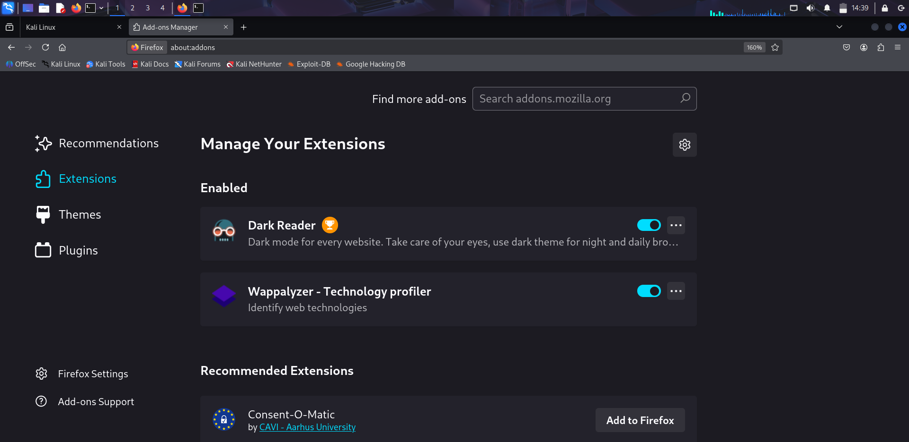

# Task 7 – Identify & Remove Suspicious Browser Extensions

## Objective
Audit installed browser extensions, identify suspicious or unused ones, remove them, and document findings.

## Environment
- **OS:** Kali Linux
- **Browser:** Firefox ESR

## Findings
**Kept/trusted extensions:**
- **Dark Reader** – Open-source, used for night mode; permissions align with purpose.
- **Wappalyzer** – Popular web technology profiler; permissions align with purpose.
- Other Mozilla default extensions – Built-in browser features, safe to keep.

**Suspicious/removed extensions:**
- None found.

---

## Risks of Malicious Extensions
- Reading/changing data on all websites without a clear purpose.
- Stealing login credentials or browsing history.
- Injecting ads, malicious scripts, or redirecting traffic.

---

## Evidence

### Before Review

### After Review

### Extension Inventory
File: [`inventory/firefox_after.tsv`](inventory/firefox_after.tsv)  
This file contains the list of installed extensions along with their permissions.

---

## Outcome
- System audited and verified.
- No suspicious extensions found.
- Only legitimate, trusted extensions remain.
